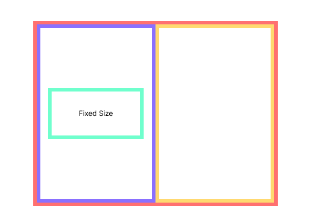
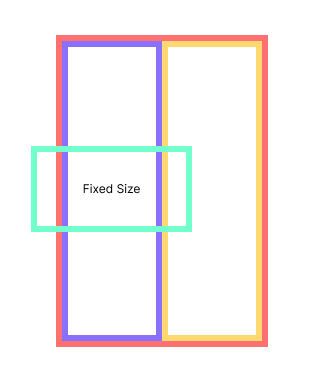
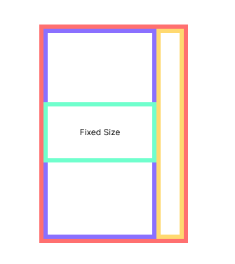
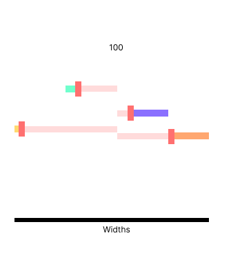
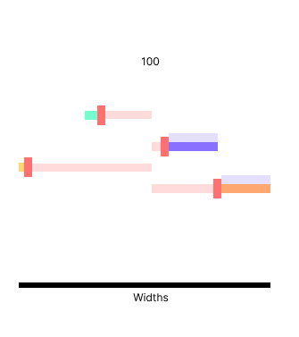
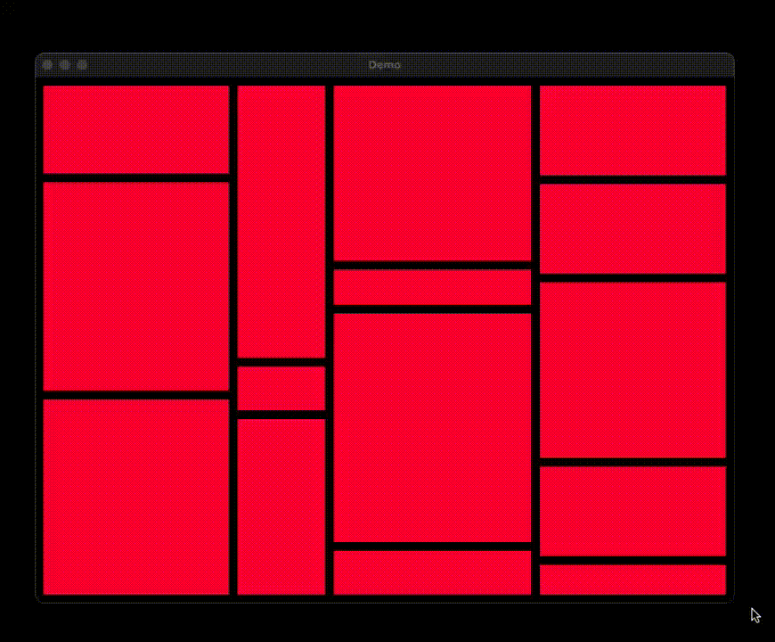

+++
title = "Constraints"
date = "2025-01-12"
updated = "2025-01-12"
+++

Author: [cyypherus](https://github.com/cyypherus)

# Constraints

Over the last year or so I've been on-and-off building a rust UI layout crate called [backer](https://github.com/cyypherus/backer). The project started with a very naive approach, as things usually do, where the layout tree is traversed, each node splitting the available area into segments or reducing the area available to children for padding.

Perfect! It couldn't be more simple, why do frameworks complicate this so much! Let's try our first layout.

I want to put my content in a row, with a fixed size-button in the first segment.

```rust
row(vec![
  my_button()
    .width(200.)
    .height(100.),
  space(),
])
```



This is fine, now what happens when the available area decreases?



Well, the entire naive approach falls apart, everything is bad, & I am bad at software.

## Onward!

So how should we handle the case where the parent is "offered" less space than it's child needs? There needs to be some interaction between a container and it's contents to ensure that we respect things like fixed size, *minimum size, or maximum size*.

Anyone who builds UI is more than familiar with the beloved concept of **constraints**, & I needed to beef up my approach quite a bit. How should a constraint system be written & more importantly, how should it behave?

First things first, containers must check with their contents to see if there are any constraints they should follow to avoid ugly overlap like we saw earlier. The ideal result should look something like this.



The yellow segment has nothing in it, so it has no reason not to compress to make room for the element with the fixed size. It should be gladly willing to compress to a width of 0.

Along with this requirement, we want to respect minimum / maximum constraints as well. Say we are laying out a row of elements that all have constraints on their widths. Our list of constraints looks like this:


```rust
row(vec![
  one()
    .width_range(50.0..75.0), // >=50 && <=75
  two()
    .width_range(110.0..150.0), // >=110 && <=150
  three()
    .width_range(..10), // <=10
  four()
    .width_range(150..), // >=150
])
```

We have 400 units of space to divvy up, what's next? 

How do we fairly allocate space to each of the elements without breaking their constraints & ensuring we use **exactly** 400 units of space?

# Dread

If you take a moment to consider it, this is actually quite tricky. The simplest approach I can imagine is to start with a guess, say, even allocation, and then nudge by tiny increments until the constraints are satisfied. Unfortunately, this can't possibly scale well, and nudging floats is terribly ugly. Surely the internet has some quick answers!

Well, seems like all we need is a [constraint solver](https://en.wikipedia.org/wiki/Constraint_satisfaction_problem). 

& it looks like the common solution in modern software is something called the [Cassowary algorithm?](https://en.wikipedia.org/wiki/Cassowary_(software))

& oh, god, cassowary is not simple at all. It's heavy on some linear arithmetic & it has some strange features that I don't necessarily even want - like the ability for constraints to be broken based on their level of priority?

This doesn't seem to be a problem that is solved frequently, or at least not in a form I'm able to find.

Anyhow, it's been effective in the past for me to let hard problems steep a while (in my head), & what else is there to do when you can't solve something?

# Aha! The Algorithm Appears

The solution arrives! (I think I was in the shower when it popped into my head, lol)

Back to our example, 400 units to divvy, & 4 elements with width constraints.

Let's start with even distribution.

First we will check if any elements constraints are not satisfied with our initial state. 

```
[100] (50..75) Bad!
[100] (110..150) Bad!
[100] (..10) Bad!
[100] (150..) Bad!
```

We then shift the allocated amounts to the nearest amount that satisfies the constraints of each element.

The initial offering, 100, is the red line. The colored rectangles are the valid ranges that we need to satisfy, & the amount we're shifting from the initial allocation is shown by the pale red / pink lines.




When we take space from an element we end up with extra space that needs to be filled - a surplus. 
Likewise, when we give space to an element we are using space we may or may not have - a defecit.

```
[75] (50..75) 
[110] (110..150)
[10] (..10) 
[150] (150..)

Defecit: 10 + 50 = 60
Surplus: 90 + 15 = 105

Pool: 105 - 60 = 45
```

We're now left with satisfied constraints, but some extra space in the pool that needs to be filled.

We need to redistribute the surplus **without** breaking any constraints, & the only way to guarantee we aren't breaking constraints is to sort the elements by the amount of space they're allowed to consume.

Both element one and element three are at their limit, but element two and four can both consume more space if needed.



We can now distribute excess starting with even distribution, or the smallest amount an element can consume - whichever is smaller. 

In our case, we're lucky enough that the pool can be distributed evenly among the candidates but in other cases we have to make the distribution in increments (using the sort I mentioned) to ensure we don't step over any constraint boundaries.


```
*Distribute 45 to the two available elements*
[75] (50..75) Good!
[110 + 22.5 = 132.5] (110..150) Good!
[10] (..10) Good!
[150 + 22.5 = 172.5] (150..) Good!
```

And finally, we've got a way to smoothly resolve constraints. The algorithm I've described is the [algorithm](https://github.com/cyypherus/backer/blob/0.11.1/src/layout.rs#L428) backer boasts today & the only reason ultra-smooth layout constraint resolution like this is possible with crates like the wonderful [egui](https://github.com/emilk/egui).



Thanks for reading & happy coding :)

****
****
