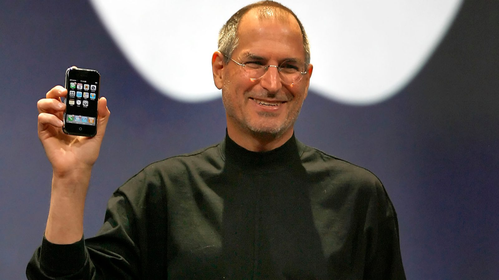
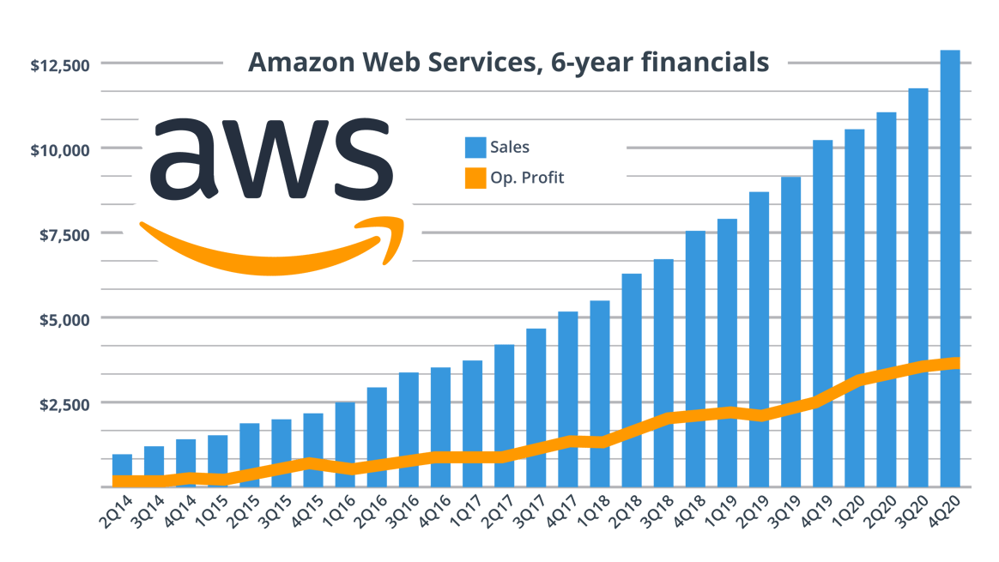

+++
title = "Part 5 - Aristophanes was right"
date = "2025-02-02"
updated = "2025-02-02"
+++

## OAuth, and Web 2.0

In 2006 a relatively minor player in this narrative joined the party. 
Twitter quickly made waves because it was, by the standards of the time, open. 
If you were cool, people with twitter could tweet right from your site.

Eventually Twitter's openness ran into the problem that every open thing does, which is that bandits show up to shut down the party.
In this case, the trouble was that people entering their Twitter password into random websites wasn't the best security practice. 

To save the people from themselves, some very smart computer folk got together and came up with a protocol called OAuth.
It's successor OAuth2.0 would become as close to singularly dominant as software gets, being the method used by Google, Meta, Microsoft, and thus anything that uses them for authentication. 
The original [OAuth rfc][oauth] is a pithy 38 pages, and well worth the read if you want to know more about auth.

So what is oauth? 
Well basically it says that you cannot be trusted to sign into things, so instead you'll just sign in to things you trust like Google and/or Meta, and they'll handle, out of the goodness of their hearts, the hard part of keeping you safe from the internet bandits. 
For their troubles, they'll get an ongoing list of every service you use from now until the end of time. 

Sounds like an even trade right?

### The smart phone

In January of 2007, Steve Jobs stepped onto the Apple stage in his trademark black turtleneck, and told the world that Apple had put an iPod in a phone with the internet. 
Missing the opportunity to call it the phoneputer, the iPhone would launch that summer starting the smart phone on the trajectory towards arguably the most important product category on Earth. 
The first android devices would launch the next year. 

In 2005, only about 10-15% of humans owned computers, and none of those who did could take them _everywhere_ and use them _all the gosh darn time._
Fifteen years later, half of all humans owned computers, with almost all of that half owning a tiny computer that was coming with them everywhere they go. 
And pretty much all of them were signed in to Google and Facebook. 

### The cloud

2007 was an auspicious year for humanity's story with computers.
A plucky book selling company named Amazon had grown to a large enough size that they were having trouble keeping everyone's carts up to date. 
To address this, they built a system called Dynamo (now branded as DynamoDB), and presented it to the world in [a paper][dynamo] at an ACM conference in the fall. 

It was a watershed moment in distributed systems design because it allowed for the system to run on a large number of (relatively) cheap machines, as opposed to the hugely expensive enterprise systems available at the time. 
People started wondering if they could lease time on these servers, and AWS was born. 

The second iPhone, and the nascent android phones came with app stores. 
This significantly lowered the barrier of entry for developers to reach users, while also providing a rapidly growing userbase eager to use their crispy new devices.
Speed was the name of the game, and if app creators could offload the boring backend stuff to someone as prestegious as Amazon, what was a few bucks a month?

This setup for backend stuff was collectively called the Cloud, and if you were around in 06 and 07 you heard it ad nauseum, but no one could explain what the heck the Cloud was.
So allow me.

The Cloud meant that instead of buying and owning the computer(s) your software ran on, you could rent computers from someone else. 
Whether that was good or bad at the time I think could be discussed, but it certainly doesn't seem great now that two of the three largest cloud platforms are run by the world's largest advertiser, and the eCommerce shop that sells you all the garbage you get advertised to about.

This was nearly twenty years ago. 
Moore's Law suggests that machines are 1,000 times more powerful today. 
Wright's Law suggests that that should correlate to a 90% decrease in price. 

Do you feel like things in the cloud are 90% cheaper?

 

------------

 

[Continue to part 6](/osf-blog/posts/you_are_not_a_number/part-6)

[fbvduguid]: https://en.wikipedia.org/wiki/Facebook,_Inc._v._Duguid
[linktree]: https://www.adamenfroy.com/linktree-alternatives
[onion]: https://theonion.com/t-herman-zweibel-in-memoriam-1819583647/
[birthday]: https://en.wikipedia.org/wiki/Birthday_problem
[elwood]: https://en.wikipedia.org/wiki/Elwood_Edwards
[oauth]: https://www.rfc-editor.org/rfc/rfc5849
[dynamo]: https://www.allthingsdistributed.com/files/amazon-dynamo-sosp2007.pdf
[bitcoin]: https://bitcoin.org/bitcoin.pdf
[sim]: https://en.wikipedia.org/wiki/SIM_swap_scam
[investigation]: https://www.vice.com/en/article/fcc-propose-fines-verizon-att-sprint-tmobile-selling-location-data/
[oh-the-forties-were-a-looong-time-ago]: https://www.nationalgeographic.com/history/article/141207-world-war-advertising-consumption-anniversary-people-photography-culture
[flatiron]: https://en.wikipedia.org/wiki/Flat_Iron_Building_(Chicago)

