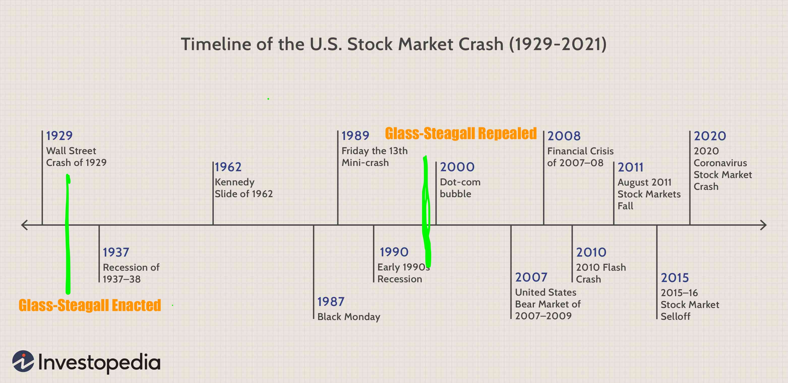

+++
title = "Part - It sure does rhyme"
date = "2025-02-02"
updated = "2025-02-02"
+++

## Hey where'd my money go?

In 2008, no...let's go back a bit.

Banks hold your money, and rather than charging you for the privelage of holding it, they re-invest it and make money off of that.
Now if they invest in something nice and safe like a mortgage that someone can afford, your money's safe, and the bank makes its income.
But if the bank goes and lays your money on red, and it spins black, your money's gone.
That might not be a huge deal if the bank can make that money back before you ask for it, but if it doesn't that's a problem.

In the 1920s, the bankers invested heavily in a stock market that could seemingly do no wrong.
Then in 1929 it all came crashing down, and plunged the country into the Great Depression.

For their role in causing the trouble, the banks were "broken up" with an act of congress known as Glass-Steagall. 
Glass-Steagall said, "you can take people's money, or you can invest in risky bullshit, but you can't do both."

Things went pretty well with respect to banks not causing global financial collapse for the rest of the twentieth century, but all good things come to an end. 
In 1999 pretty much everyone in DC was ready to let the banks go back to the roulette table, and Glass-Steagall was repealed.

Now the thing about money is that a sudden increase in its supply doesn't make more things to purchase appear out of thin air. 
Instead the increased demand causes the price of the existing assets to rise.
If they rise fast enough, this is called a bubble. 

Like the dotcom bubble that happened in, _checks notes_, 2001.

||
|:--:|
|*Well correlation may not equal causation, but like maybe that shouldn't matter when we're dealing with banks playing with our money*|

Luckily everyone learned their lesson from that bubble burst, and decided to invest in the much safer realm of real estate mortgages.

The same increased demand that caused the dotcom bubble, had a different effect in real estate where the price of the investment vehicles was much less volatile.
In order to meet the increased demand, lenders had to create more investment vehicles.
Part of this was done by creating convoluted derivatives of derivatives of investments, and part of this was done just by giving people more mortgages.

When you combine these two things you end up with assets that are both risky, and impossible to assess the risk of. 
In September of 2008, a large investment bank, Lehman Brothers, filed for bankruptcy. 
When they did it "broke the buck," a term used when a money market fund's net asset value falls below $1 per share.[^8]

All hell broke loose, and if you were around back then, it felt like the sky was falling.

### Like a p5x we rise

Now the nice thing about the whole housing crisis thing is that it only really hurt the folks who shouldn't have been getting mortgages in the first place, the hard working people dependent on those people, the communities those people lived in, and was in no way bias along racial lines (this is of course not nice at all, but not being snarky makes it too depressing).
The people and banks with plenty of money were largely fine. 

This is because when you give someone a mortgage you actually own the property the mortgage is for.
So when they can't pay, you foreclose on them, and now you own the house.
Sure you take a little hit on the house's value, but you're a bank so you know that value's going to come back up.
After all, there're a bunch of people who need housing now.

But now everyone needed a new thing to invest in. 
Enter Andreessen Horowitz aka a16z, and the VCs.

I asked ClaudeAI what the difference between the VCs, and the dotcom investors are, and it gave me some nonsense about how companies are more proven these days, and blah blah blah. 
It's the same song and dance: too much money chasing too little value. 

Sometimes in life you've just got to hang in there.
Friendster and MySpace went home too early, leaving Facebook hanging around the DJ Booth when the after hours crowd poured in.
The phoneputers became the perfect device for all those folks without houses, and since people get bored they were hungry for something to do on the machines. 
All the doom scrollers needed to scale was piles of money, and since nothing else was appetizing at the time, the VC-era took off.

---------------

[Continue to part 7](/posts/you_are_not_a_number/part-7)

[fbvduguid]: https://en.wikipedia.org/wiki/Facebook,_Inc._v._Duguid
[linktree]: https://www.adamenfroy.com/linktree-alternatives
[onion]: https://theonion.com/t-herman-zweibel-in-memoriam-1819583647/
[birthday]: https://en.wikipedia.org/wiki/Birthday_problem
[elwood]: https://en.wikipedia.org/wiki/Elwood_Edwards
[oauth]: https://www.rfc-editor.org/rfc/rfc5849
[dynamo]: https://www.allthingsdistributed.com/files/amazon-dynamo-sosp2007.pdf
[bitcoin]: https://bitcoin.org/bitcoin.pdf
[sim]: https://en.wikipedia.org/wiki/SIM_swap_scam
[investigation]: https://www.vice.com/en/article/fcc-propose-fines-verizon-att-sprint-tmobile-selling-location-data/
[oh-the-forties-were-a-looong-time-ago]: https://www.nationalgeographic.com/history/article/141207-world-war-advertising-consumption-anniversary-people-photography-culture
[flatiron]: https://en.wikipedia.org/wiki/Flat_Iron_Building_(Chicago)

[^8]: So banks don't hold a lot of cash, because cash is better used in investments. So to handle their day-to-day operation they borrow money for really short terms (like for a day) from money market funds. They pay this back with a small amount of interest, and that gets paid to the investors in the money market. When Lehman Brothers collapsed, the debt it owed to the money market represented money that was effectively gone.

