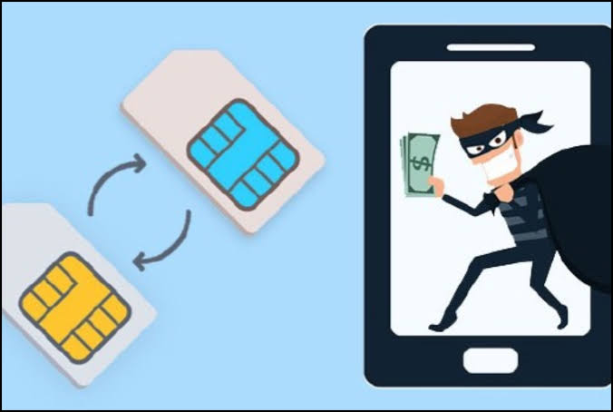

+++
title = "Part 8 - The cell saga"
date = "2025-02-02"
updated = "2025-02-02"
+++

## Two-factorin'

So it's the late aughts, you're Google, you have a near monopoly on where people are logging in because they're all using your email, and now, thanks to the benevolence of your Android operating system, you know everyone's phone numbers, and can even construct a social graph similar to Facebook's via access to people's contacts.
There's just one rub: that darn iPhone's around, and Apple doesn't want to share.

So the braintrust came up with the genius idea of making you're already secure accounts _even more secure_ by adding two-factor authentication via sms.
Google released this 2FA in 2011 because the world was clearly unable to function without it up until that point.

The rise of two-factor authentication via sms provides an important lesson on how additional complexity often leads to _less_ security, and not more. 
Whenever you deal with consumers who might be miffed if you lose all their data, you need to provide a way for them to recover accounts. 
Most of the time you do that via email. 
But what do you do if the account they care about is email?

Google, and others with 2FA, said, "no problem, we'll just use your phone number."
But then the question became what if you had your phone stolen, or you lost it.
Well then the security of 2FA would be dependent on the carriers' ability to protect your interests.

||
|:--:|
|*If only all bandits would show up in uniform*|

Now I've worked retail, and I have the utmost respect for people who do, and their capabilities.
I do not have much faith in the corporations who pay these good people a pittance to be on their frontline.
A company who does that, probably isn't going to put much thought into making sure you're you when you go to replace your phone.

The vulnerability here wasn't exposed for a while because, despite how you might feel, the Harry Potter fanfic in your google drive isn't all that valuable.
But when crypto became valuable enough for bandits to want to steal, they started stealing people's phone numbers by just going into stores and requesting sim cards as that person in what's called a [SIM swap attack][sim]. 

### Where you at?

Now you might be wondering what's the big deal with phone numbers in the first place. 
If you're old like me you might remember a time when we just published all our phone numbers in a book, with our name and addresses, and then gave everyone that book for free.
If you're not old like me I'd be curious what your thoughts are on that practice.

Have you ever wondered what the cell in cellular refers to? 
I hadn't until I started researching this whole rigamarole. 

||
|:--:|
|*A cellular network*|

Our phones communicate wirelessly, and since they're small, the distance that they can communicate at is fairly limited.
So to accommodate them, cell towers are setup every so often around the Earth for them to connect to.
These towers define a cell, and as you travel the Earth your phone switches from tower to tower as you move from cell to cell.

Now the telecomms companies aren't supposed to provide this data to anyone, but [of course they do][investigation], because when they got caught the FCC fined them a whole $200 million, a little under one dollar for everyone whose location they were selling.
But even if the telecomms didn't sell this data, your phone would report it back anyways through background networking tasks, or just plain old checking your phone at a red light.

Now location wouldn't be that big of a deal I guess if you didn't have at your disposal the largest database of location-based info on Earth. 
But of course the company doing all of this _was_ the company with the largest database of location-based info on Earth. Almost as if this whole getcha phone to getcha location was planned or something.

And what do you do with all this info?
Well you know that creepy thing that happens sometimes where you were talking about a thing with a friend and then you start getting ads for it? 
Well I have no doubt that sometimes you're being listened to, but most of the time what's happening is that one of you googles that thing, and then because google (and the rest of the gigantocorps for that matter) know that you were with that person, the ad netwroks serve you an ad about that thing too. 

 

--------------

 

[Continue to part 9](/osf-blog/posts/you_are_not_a_number/part-9)

[fbvduguid]: https://en.wikipedia.org/wiki/Facebook,_Inc._v._Duguid
[linktree]: https://www.adamenfroy.com/linktree-alternatives
[onion]: https://theonion.com/t-herman-zweibel-in-memoriam-1819583647/
[birthday]: https://en.wikipedia.org/wiki/Birthday_problem
[elwood]: https://en.wikipedia.org/wiki/Elwood_Edwards
[oauth]: https://www.rfc-editor.org/rfc/rfc5849
[dynamo]: https://www.allthingsdistributed.com/files/amazon-dynamo-sosp2007.pdf
[bitcoin]: https://bitcoin.org/bitcoin.pdf
[sim]: https://en.wikipedia.org/wiki/SIM_swap_scam
[investigation]: https://www.vice.com/en/article/fcc-propose-fines-verizon-att-sprint-tmobile-selling-location-data/
[oh-the-forties-were-a-looong-time-ago]: https://www.nationalgeographic.com/history/article/141207-world-war-advertising-consumption-anniversary-people-photography-culture
[flatiron]: https://en.wikipedia.org/wiki/Flat_Iron_Building_(Chicago)

